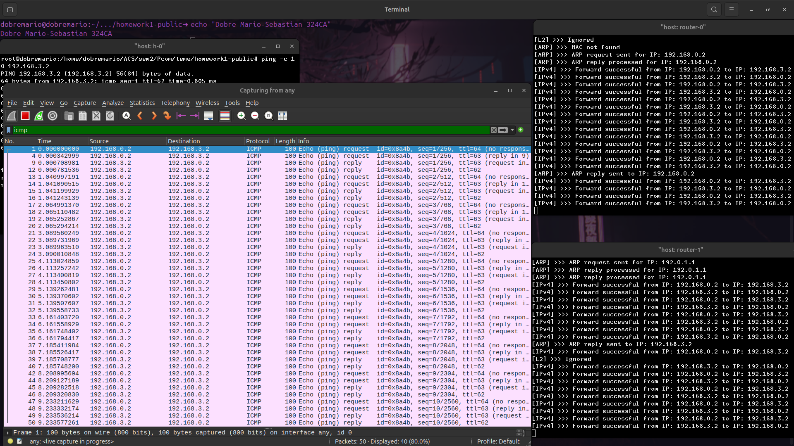
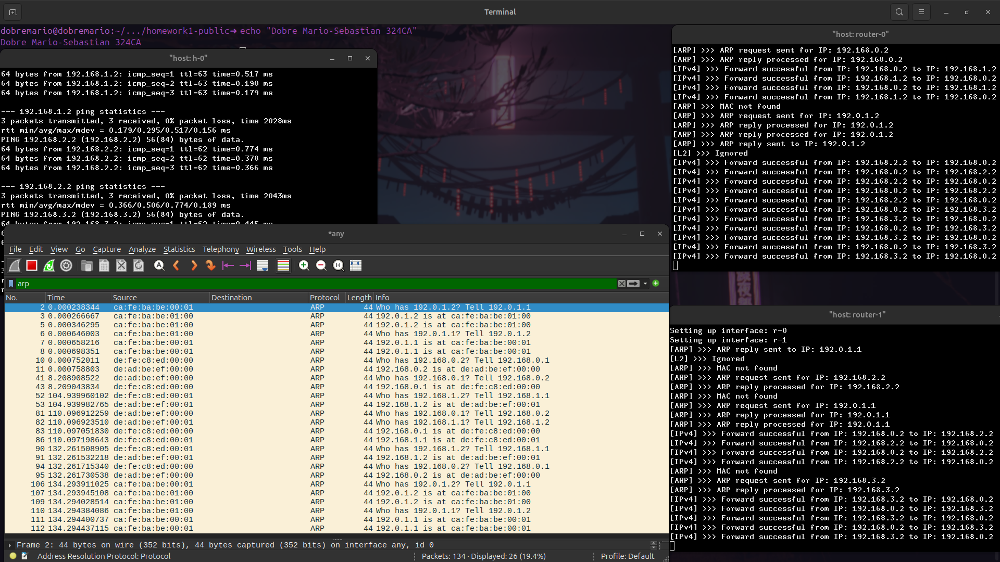
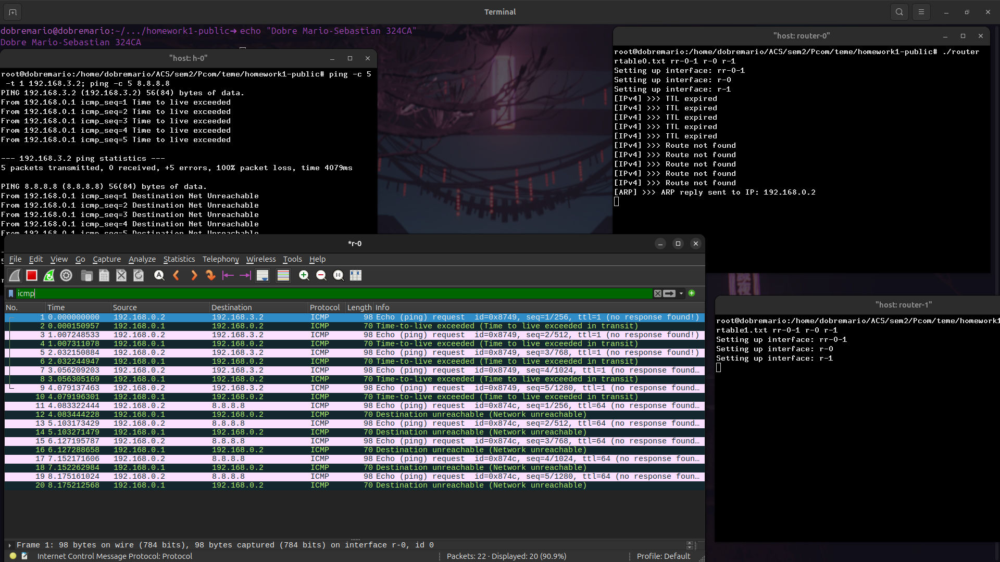

# Homework 1 - Router Dataplane

**Name:** Dobre Mario-Sebastian  
**Group:** 324CA

## General Description
This project implements the routing process (data plane) of a network layer (Layer 3) router. It supports the IPv4 protocol, efficient routing via **Longest Prefix Match (LPM)**, **dynamic ARP** resolution, and the generation of **ICMP** error messages.

---

## Topic 1: Forwarding Process
The basic implementation was based on the laboratory logic. When an IPv4 packet is received, the router performs the following steps:
1. **Checksum Validation:** Ensures the integrity of the packet data.
2. **Route Lookup:** Identifies the best route for the destination.
3. **TTL Update:** The TTL is decremented, and the checksum is efficiently recalculated.
4. **Transmission:** The packet is sent to the corresponding next-hop interface.

*The image demonstrates the successful routing of Echo Request/Reply packets between two different subnets (end-to-end ping).*

---

## Topic 2: Efficient LPM (Longest Prefix Match) Implementation
For an efficient search of the most specific route, I replaced the linear/binary search with a specialized data structure. I analyzed three variants:

* **Van Emde Boas tree:** Excellent time complexity, but inefficient due to massive memory consumption.
* **Radix Trie:** Spatially and temporally efficient, but presents implementation difficulties for masks that are not powers of 2.
* **Standard Trie:** A balanced structure with decent memory usage and excellent search time.

**Choice:** I implemented a **Trie**. For 32-bit IPv4 addresses, the search is performed in constant time **O(32)**, making the router extremely scalable for large routing tables.

---

## Topic 3: Dynamic ARP Protocol
The ARP table was implemented using a **hashtable** (`std::unordered_map` from C++). I chose this approach to achieve an amortized search complexity of **O(1)**, as the MAC address lookup is a critical operation.

**Queueing Mechanism:**
When the router does not know the destination's MAC address:
1. The ICMP packet is placed in a queue (`std::queue`).
2. A broadcast **ARP Request** message is sent.
3. Upon receiving an **ARP Reply**, the address is added to the O(1) cache.
4. The packet is dequeued and sent over the network.

---

## Topic 4: ICMP Protocol
The router was extended to notify the source in case of errors, following the ICMP standard:
* **Time to Live Exceeded (Type 11):** Generated if the packet has TTL ≤ 1.
* **Destination Unreachable (Type 3):** Generated if the LPM algorithm finds no valid route.
* **Echo Reply (Type 0):** The router responds to pings destined for its own interfaces.

*The image demonstrates the Wireshark capture of the correct generation for both error types (Type 11 and Type 3) when simulating a non-existent route and a packet with limited TTL.*

---

<small>*Technical Note on Queueing: I chose to use `std::queue` from the C++ STL instead of the provided C queue implementation. When compiling with C++, the skeleton's queue caused naming conflicts. Since the assignment strictly forbids modifying `lib.c` and the provided includes, using the STL queue was the safest, most robust, and rule-compliant alternative.*</small>
